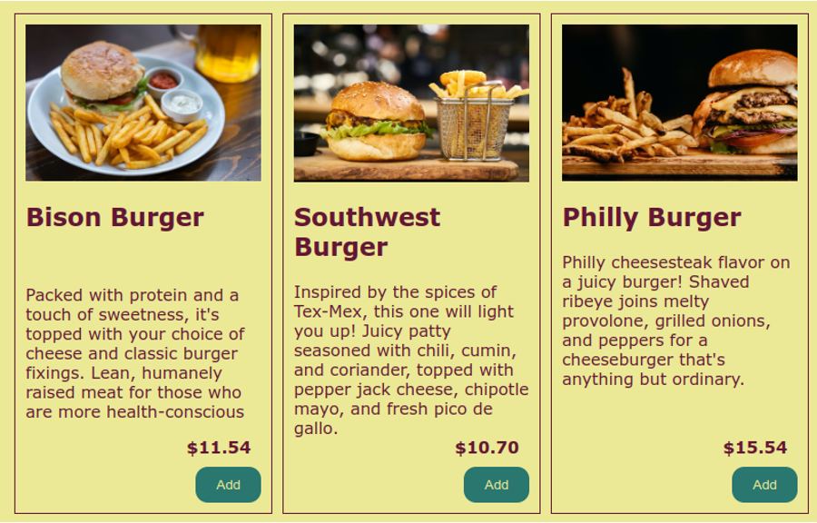

= HTML/CSS/JavaScript/React Capstone Project

*Restaurant Ordering Web App*

We will create a React web application for ordering dinner at a restaurant. The app will feature a home page with a menu of all food options. The user can select entrees, side dishes, and desserts. When ready they can view their cart, add details like "extra ketchup" or "hold the mayo". They'll then be able to log in with username and password and check out with a credit card. The app will show their order summary. They can also review their old orders in history.

Since this is a frontend-only section of the bootcamp, the backend API server is provided for the student. It is written using Java Spring Boot with a lightweight MySQL/MariaDB database behind it (see Before Starting).

== General Tasks

.	Create the React and TypeScript application with vite, npm or pnpm, or system of your choice.
.	Make the application read *menuitems* from the API server and iterate them on the home screen.
..	The URL will be http://localhost:8080/api/menuitems or similar
..	Use a proxy in your config file such as vite.config.ts
.	The menuItems should be in their own component and be styled like a card. 
.	Each card will display an image of each item, its brief description, and price.
+

.	These menuItems should be laid out in a responsive way so that the cards are side-by-side to fill the width of the screen and then wrap down to the next line so that the user only scrolls along the vertical axis.
+

.	Implement routing using react-router-dom
.	Create a component for the header that will be displayed in the App component so that it appears in every view.
.	The header component shall have at minimum a navigation menu with navigation links for Home, Checkout, Orders, and Login.
+

.	Create a cart object that is shared across all components. This can be done using a state management solution like Redux, or props drilling, or useContext.
.	In the menuItem card wire up Add To Cart buttons which add to a site-wide cart object
.	Display the cart contents and a calculated order total in a Checkout component.
.	Create a form that reads credit card information (PAN, expiryMonth, expiryYear, CVV).
.	Allow the user to submit their order to the server and forward the user to the Order component.
.	Create the Order component. It will serve as a customer receipt so it must display the order details like the date and time, menuItems ordered, prices, tax, tip, total paid.
.	Create an Orders component that provides a list of Orders that, when clicked, will navigate to the Order component with the orderId as a route parameter.

== Extra Mile Tasks

.	Create a register component with a form to allow the user to create a new user on the server.
..	http://localhost:8080/users
..	This is a POST request
..	Minimum JSON body
+
[source,json]
----
{
    "username": "steve",
    "password": "pass",
    "first": "Steve2",
    "last": "Shilling",
    "roles": "USER"
}
----
.	Create a login component with a form. It should submit username and password to the authentication server and receive back a validation token on successful login or read a 401 response on failed.
..	http://localhost:9000/login
..	Note this server returns a JSON Web Token (JWT) which should be used in the header as a Bearer Token when requesting resources from the server running on port 8080 (if you have enabled security).
.	The user should be notified about their successful or unsuccessful login result.
.	Allow the user to add notes to each cart item.
.	Allow the user to assign each menu item to a member of their party by first name.
.	Implement Luhn's algorithm to check the credit card digits.
.	Put in validation to make sure the card entered hasn't expired.
.	Validate that the CVV is three digits.
.	When authenticated, greet the user by first name in the menu and provide a link to log out. When not authenticated, show the menu option to log in.
.	When the user logs in successfully, automatically navigate them to the main/home route.
.	Allow the user to remove menu items from the cart via a delete button.
.	Allow the user to add a tip to the order.

== Before Starting

You will need to launch the backend Java application before starting the project.

There are 3 parts to the backend service;

.	A MariaDB/MySQL database called *daamdb*
..	This database is empty by default, and built and initialized by the 2 Java applications
.	An authentication server that generates a JWT for use with the main application.
..	You can run the application without this server.
..	This server runs on port *9000* by default but can be changed by setting an environment variable *SERVER_PORT* to a different value before running the application, or by providing your own application.properties file.
..	The default database user is *root*
..	The default database password in the application is *secret123*.  This can be changed by setting the environment variable *DB_PASSWORD*
.	The application server, which by default will run in security mode.
..	You can turn off the security mode by setting an environment variable *DAAM_SEC=false* and then running the java application.
...	If you are running with security you will need to pass a Bearer Token to any API call.  The Bearer token is the body returned by the authentication server's /login.
...	To login to the authentication server you will need to use *Basic Authentication* and provide a username which can be found in the *users* table of the database, once the authentication application is running.  All passwords for the users are set to *pass* and Bcrypted.
...	Some users to start with
admin, me
..	The server runs on port *8080* by default
..	The default database user is *root*
..	The default database password in the application is *secret123*.  This can be changed by setting the environment variable *DB_PASSWORD*
..	The application has built in API documentation
http://localhost:8080/swagger-ui/index.html

== Launching the Application

The database service should already be running on your system.  Use the database application to check if there is a *daamdb* already on the server.

If there is not then simply create a new database and name it *daamdb*.

.	Launch the Authentication server first.
..	Open a command prompt or PowerShell, or GitBash
..	Change to the *Auth* directory on your system
..	In the application.properties file change *secret123* to the password for the database server, or set the DB_PASSWORD environment variable
..	Launch the Java application with; +
`java -jar daam-auth-0.0.1-SNAPSHOT.jar`
.	Launch the resource application server's
..	Open another command prompt, PowerShell or GitBash terminal
..	Change to the *S*erver* directory
..	Change the database password as in step 3 for the authentication server
..	Turn off the security to start with, either by
...	Editing the application.properties file and setting *security.enabled=false*
...	Or setting the environment variable *DAAM_SEC=false*
...	You can set it to true later when you need authentication
..	Launch the Java application with; +
`java -jar daamsrv-0.0.1-SNAPSHOT.jar`

== Notes on the API

.	When using the *POST* methods you do not need to supply the id: field, as shown in Swagger, since these values are automatically assigned by the database.
.	The *items* API allows you to assign menuItems, etc to an *order*.  You will need to obtain an Order number first as the *items* API requires an order number for each item, but the *items* API takes an array of *item* JSON objects, allowing you to add multiple items to a single order in one go.  If you need to add a single item, then you'll still need an array of 1 item.
.	When deleting an order you will also need to delete the items, as the database does not provide referential integrity or cascading, since the original project used noSQL.
.	The /swagger-ui/index.html can only be view when authentication is turned off by setting the environment variable *DAAM_SEC=false* or editing *security.enabled=false* in application.properties.
.	There are 2 JSON files
..	The files
...	DAAM Auth Service.postman_collection.json
...	DAAM Service.postman_collection.json
....	You'll need to change the port number from 8180 to 8080 in the examples
..	These files can be loaded into the Postman application if you have a Postman account.  It is free to create an account on Postman, but do not use your company information to sign up.
..	These will allow you to see some examples of using the API.
